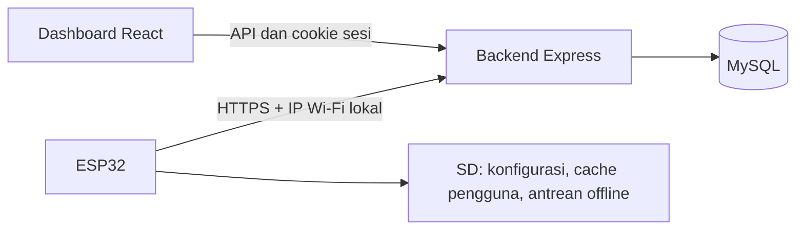

# Arsitektur dan alur data

## Komponen aktif

Saat development, Vite pada port 3000 mem-proxy `/api` ke backend port 5002. Saat production, reverse proxy HTTPS menyajikan `frontend/dist` dan meneruskan `/api` ke backend yang hanya bind ke loopback. ESP32 memakai hostname HTTPS dan mengirim IP Wi-Fi lokal secara otomatis. IP pada dashboard harus sama dengan IP ESP32 dan unik untuk tiap boks; reservasi DHCP menjaga nilainya tetap. HTTP hanya diterima untuk endpoint LAN privat yang dipilih eksplisit.

## Identitas dan otorisasi

Browser login memakai SID dan password bcrypt. Akun baru memerlukan password unik minimal 12 karakter. Server menyimpan hash token sesi di `web_sessions` dan memberikan cookie HttpOnly selama delapan jam. Frontend menyimpan token CSRF di memori dan mengirimkannya pada mutasi. Identitas dan role dipulihkan melalui `/api/users/me`; role terbaru dibaca dari database.

ESP32 memakai `X-Device-IP`; backend mencocokkannya dengan IP boks yang didaftarkan di dashboard lalu membatasi operasi ke boks tersebut. Counting tidak dipakai pada alur perangkat ini. Login browser tetap memakai sesi dan CSRF. Aturan role berada di [authorization.js](../backend/middleware/authorization.js).

## Telemetri dan sesi

ESP32 mengirim `event_id` untuk deduplikasi. Backend mengunci baris boks dalam transaksi dan mencatat receipt di `device_events`; pengiriman ulang ID yang sama tidak menggandakan perubahan. Event langsung memperbarui snapshot boks, antrean pekerja, dan riwayat sesuai jenis event. Sesi dibuka pada `SUPERVISOR_LOCK_IN` dan ditutup oleh event logout/penutupan yang sesuai.

Replay offline dicatat tanpa menimpa snapshot langsung. Waktu penerimaan replay tidak membuktikan waktu kejadian aslinya. Jika asal sesi tidak diketahui, backend tidak mengarang kaitan sesi. Detail implementasi ada di [telemetryModel.js](../backend/models/telemetryModel.js).

## Perintah perangkat

Perintah menggunakan tabel `device_commands`, terpisah dari telemetri. API hanya menerima `SYNC_USERS`. ESP32 mengambil perintah, memperbarui cache, lalu ACK ID setelah berhasil. Perintah memiliki masa berlaku sepuluh menit; antrean dibatasi 20 perintah pending yang belum kedaluwarsa per boks. Tidak ada perintah remote untuk membuka relay.

## Counting

Worker counting tidak digunakan pada konfigurasi saat ini. Endpoint dan tabel counting yang sudah ada tidak diperlukan untuk alur ESP32 dan dashboard.

## Batas sistem

Tes lokal memakai database tiruan dan tidak membuktikan konsistensi perangkat fisik. Konkurensi firmware, kegagalan SD, pemulihan setelah listrik padam, serta perilaku relay perlu diuji. Lihat [audit production](PRODUCTION_AUDIT.md) sebelum menetapkan kesiapan operasional.
